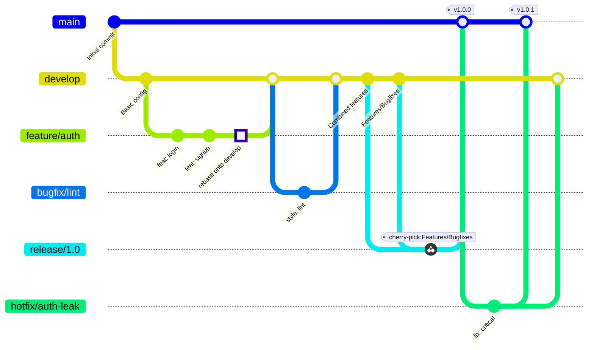
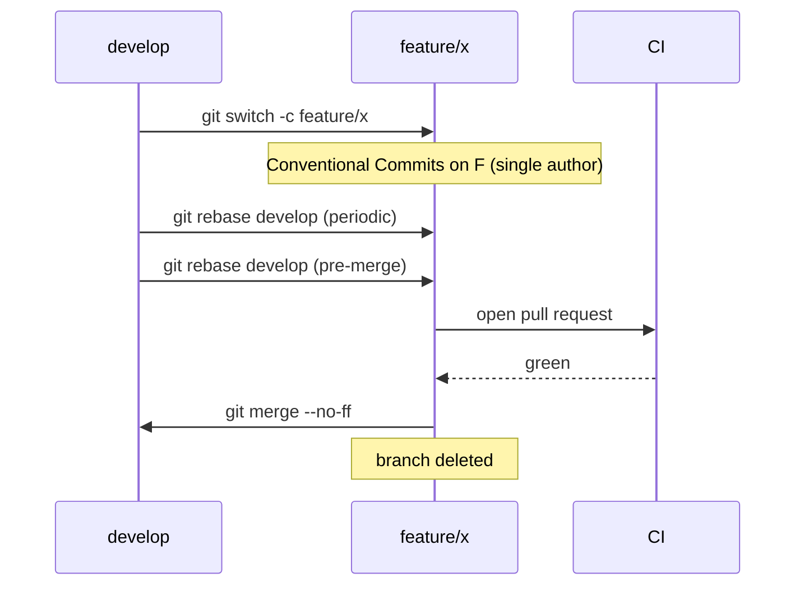
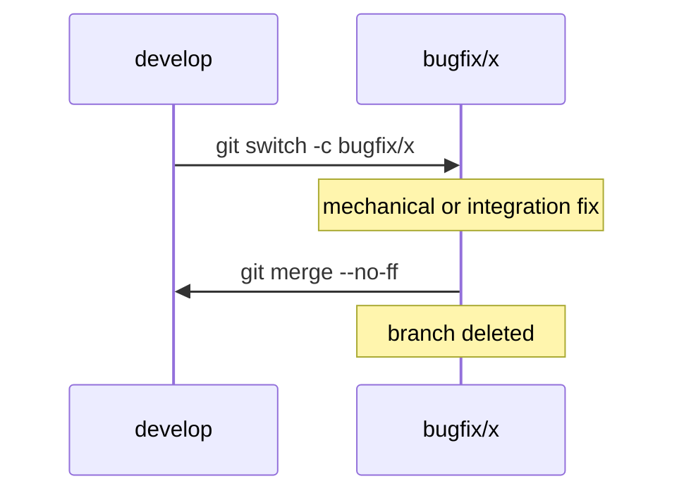
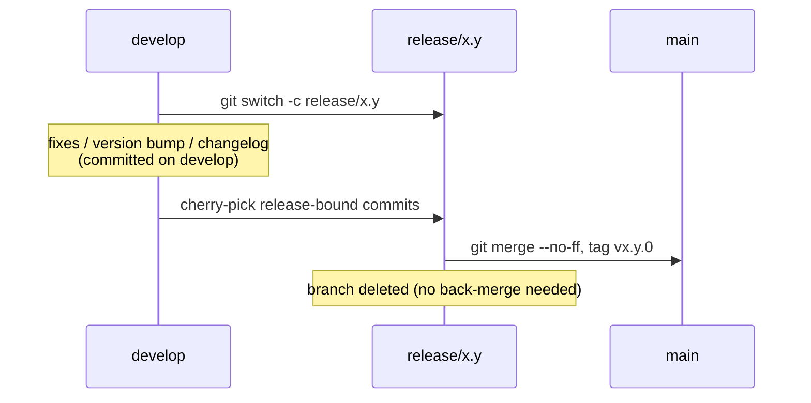
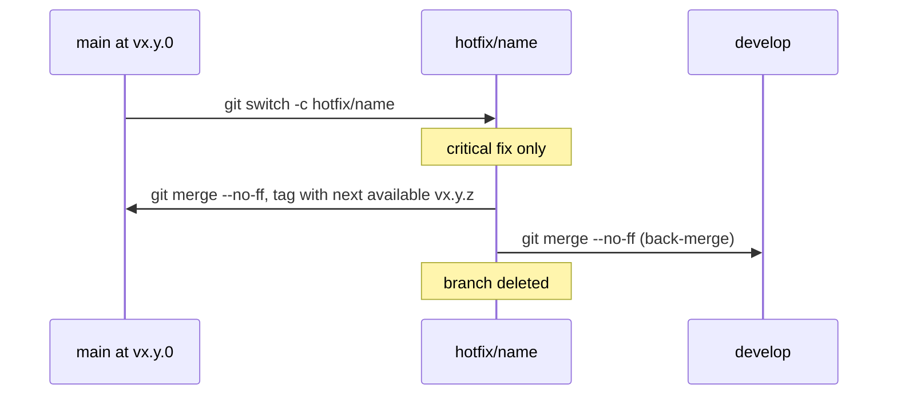

+++
title = "LoomFlow"
date = 2021-08-16
template = "static-page.html"

[extra]
mermaid = true
+++

## A Git Branching Model for Versioned, Collaborative Software Development

---

### Abstract

LoomFlow is a Git branching model that extends Vincent Driessen's _A Successful Git Branching Model_ (commonly known as Git Flow) with six substantive additions: (1) a first-class `bugfix/*` lane for post-integration fixes; (2) a Semantic Versioning–aligned naming convention for release branches; (3) a cherry-pick-only contract for release branches that preserves scope freeze and eliminates the customary back-merge to `develop`; (4) a single-author rule for feature branches coupled with periodic and pre-merge rebase syncing against `develop` (a form of *reverse integration*); (5) a uniform `--no-ff` merge convention paired with delete-on-merge for short-lived branches, ensuring per-commit signal and integration boundaries both survive branch deletion; and (6) explicit, normative bindings to Conventional Commits, gitmoji, Keep a Changelog, and Semantic Versioning. The model is designed to remain coherent under heavy parallelism in teams of mixed-discipline contributors and automated tooling (linters, formatters, dependency-update bots), and is intended for projects that ship versioned, deployable artifacts. This article specifies the model, illustrates its lifecycles, and defends each significant design choice against the most common alternatives.

---

### 1. Introduction

Branching models exist on a spectrum of ceremony. At one extreme, Trunk-Based Development minimizes branches to favor continuous integration. At the other, Git Flow defines five branch types and a layered release pipeline. Each point on the spectrum encodes implicit assumptions about deployment cadence, team composition, release granularity, and the marginal cost of merge integration.

LoomFlow occupies a deliberate point on this spectrum. It is intended for projects that

- maintain at least one pre-production environment (staging, QA, release-candidate),
- ship discrete, versioned releases rather than continuously deploying from `main`,
- absorb parallel work streams that may include automated tools (linters, formatters, dependency-update bots), and
- treat the production branch as a stabilized, auditable artifact rather than a moving target.

The name _LoomFlow_ reflects the model's central metaphor: parallel threads — features, bugfixes, and contributions from multiple authors — are woven through an integration branch into the finished cloth of a tagged release. The integration buffer is not ceremony; it is the loom.

---

### 2. Related Work

**Git Flow** (Driessen, 2010) defines `main`, `develop`, `feature/*`, `release/*`, and `hotfix/*` branches. It remains influential but is widely criticized for ceremony when applied to continuously deployed services with no meaningful release window.

**GitHub Flow** (Chacon, 2011) collapses Git Flow to `main` plus topic branches. It assumes continuous deployment from `main` and relies on strong CI for safety. It is well-suited to web services but provides no integration buffer between feature work and production.

**GitLab Flow** introduces environment branches (e.g., `production`, `pre-production`) downstream of `main`, accommodating regulated release cycles without the full Driessen pipeline.

**Trunk-Based Development** advocates very short-lived branches integrated directly into `main`, with feature flags rather than long-lived branches as the primary mechanism for managing in-flight work.

**OneFlow** (Ruka, 2015) simplifies Git Flow to a single long-lived branch by reframing `develop` and `main` as derivable from tags rather than from branch state.

LoomFlow's closest relative is Driessen's Git Flow. The principal differences are detailed in §6.

---

### 3. Branch Topology

LoomFlow defines six branch types, summarized in Table 1.

**Table 1. LoomFlow branch types.**

| Branch           | Base      | Merges Into          | Lifetime    | Purpose                                          |
| ---------------- | --------- | -------------------- | ----------- | ------------------------------------------------ |
| `main`           | —         | —                    | Permanent   | Production-grade, tagged artifact lineage        |
| `develop`        | `main`    | `release/x.y`        | Permanent   | Integration of completed feature and bugfix work |
| `feature/{name}` | `develop` | `develop`            | Short-lived | New functionality                                |
| `bugfix/{name}`  | `develop` | `develop`            | Short-lived | Post-integration fixes on `develop`              |
| `release/{x.y}`  | `develop` | `main`               | Short-lived | Stabilization of a candidate release             |
| `hotfix/{name}`  | `main`    | `main` and `develop` | Short-lived | Critical patch against a released version        |

The overall topology and standard merge directions are illustrated in Diagram 1.



_Diagram 1. LoomFlow branch topology and standard merge directions. The highlighted "rebase onto develop" node is a visual marker — Mermaid gitGraph cannot depict the SHA-rewriting effect of an actual rebase, so a sentinel commit stands in for it._

---

### 4. Branch Specifications

#### 4.1 `main`

`main` is the canonical production lineage. It accepts merges only from `release/*` and `hotfix/*`. Every merge to `main` is followed immediately by an annotated tag conforming to SemVer (e.g., `v1.4.0`, `v1.4.1`). `main`'s history is therefore a strict, monotonically increasing sequence of released versions.

`main` is never the direct target of feature, bugfix, or develop merges.

#### 4.2 `develop`

`develop` is the integration branch. It is forked from `main` at project inception and is maintained in perpetuity. Feature and bugfix branches merge into `develop`; releases are cut from `develop`; hotfixes are back-merged into `develop` after landing on `main`.

`develop` is expected to remain in a buildable, test-passing state at all times. Broken state on `develop` is a defect, not an acceptable transient — if integration breaks `develop`, the breaking merge is reverted or repaired immediately.

#### 4.3 `feature/{name}`

Feature branches are short-lived branches off `develop` for new functionality. The `{name}` segment is a kebab-case identifier referring to the work, not the author (e.g., `feature/oauth-pkce`, `feature/cli-completion`). Feature branches merge back into `develop` via pull request using `git merge --no-ff` (see §6.7) and are deleted upon merge.

**Single authorship.** Each feature branch belongs to exactly one author. Multiple concurrent contributors on a single feature branch defeat the rebase-sync rule below and complicate the branch's history; if a feature is large enough to require multiple contributors, it is large enough to be decomposed into smaller features.

**Rebase sync (periodic and pre-merge).** The feature author MUST rebase the branch onto `develop` (a) periodically during development and (b) immediately before opening the pull request that merges the feature back. Rebasing keeps the eventual merge conflict-free or near-trivial, and — critically — routes conflict resolution to the author, who holds the smallest cognitive context (their own delta against `develop`) rather than to whoever performs the merge. Rebase (not merge) is the prescribed sync mechanism because the single-author convention makes the branch unshared, so rewriting its commit SHAs is safe; using merge instead would accumulate avoidable merge commits in the feature's history.

A feature branch represents _complete_ work in scope. Partial features should not be merged with the expectation of subsequent fix-up commits on the same branch (see §4.4 and §6.1).

#### 4.4 `bugfix/{name}`

Bugfix branches are short-lived branches off `develop` for _post-integration_ fixes. Their justification — the principal addition LoomFlow makes to Driessen's original model — is detailed in §6.1. Typical contents include:

- automated style and convention fixes contributed by bots (linters, formatters, dependency-update tools),
- integration regressions surfaced after one or more features have merged into `develop`,
- non-blocking review follow-ups identified after the original feature has merged.

Bugfix branches are _not_ a venue for completing work that should have been finished on the originating feature branch. This boundary is enforced at review.

Bugfix branches merge back into `develop` using `git merge --no-ff` (see §6.7) and are deleted upon merge.

#### 4.5 `release/{x.y}`

Release branches are short-lived stabilization branches cut from `develop` when `develop` is judged ready for a candidate release. The branch is named with the upcoming **major and minor only** (e.g., `release/1.4`), reflecting that patch-level work performed during stabilization belongs in the same release line and produces the same `x.y.0` tag.

Activity on a release branch is restricted to **cherry-picks from `develop`**. Any change destined for the release — defect fixes discovered during stabilization, version-string bumps, changelog finalization, documentation polish — is committed on `develop` first (typically via a `bugfix/*` branch as per §4.4) and then cherry-picked onto the release branch.

Two corollaries follow:

- **No direct commits.** A release branch never contains a commit authored on the branch itself; every commit is a cherry-pick of a commit that already exists on `develop`.
- **No back-merge to `develop`.** Because every commit on the release branch already exists on `develop` (as the cherry-pick source), there is nothing to propagate back; the back-merge step common to Driessen's Git Flow is unnecessary in LoomFlow.

Likewise, `develop` is never merged into a release branch — such a merge would defeat scope freeze by importing whatever has accumulated on `develop`, including in-flight features. The cherry-pick discipline imports only what is explicitly intended for the release.

When the release branch is judged production-ready, it is merged into `main` using `git merge --no-ff` (see §6.7) and tagged `vx.y.0`. The branch is then deleted.

#### 4.6 `hotfix/{name}`

Hotfix branches address critical defects in an already-released version. They are cut from `main` at the tag of the affected release. The branch is named with a kebab-case identifier describing the defect (e.g., `hotfix/auth-token-leak`, `hotfix/csv-parse-crash`), **not** with the target patch version. The rationale — multiple hotfixes may be in flight against the same released version concurrently, with the eventual patch number known only at the moment of merge to `main` — is detailed in §6.2.

A hotfix merges into `main` using `git merge --no-ff` (see §6.7), where it is tagged with the next available patch version (`vx.y.z+1` relative to the highest existing tag on the affected release line), and is also `--no-ff` merged into `develop` so the fix is retained in the integration history. If a `release/*` branch is in flight at the time of the hotfix, the fix is additionally **cherry-picked** onto it (consistent with the cherry-pick-only rule for release branches; see §4.5) to avoid regression on the upcoming release. The hotfix branch is deleted after both merges complete.

---

### 5. Convention Bindings

LoomFlow is not branch topology alone; it is a contract between branch topology, commit format, version semantics, and changelog discipline. The bindings below are normative.

#### 5.1 Commit Format

All commit messages MUST conform to the latest specification of **Conventional Commits**. The leading emoji prefix from **gitmoji** MAY precede the Conventional Commits header:

```
{gitmoji} type(scope)!: description

Optional body explaining motivation, context, and trade-offs.

BREAKING CHANGE: explanation of incompatibility, if applicable.
Refs: ISSUE-123
```

Examples:

```
✨ feat(auth): add PKCE flow to OAuth client
🐛 fix(parser): handle trailing comma in CSV with quoted fields
♻️ refactor(http)!: collapse retry callback into RetryPolicy

BREAKING CHANGE: HttpClient.retry() now accepts a RetryPolicy
instance instead of a (attempt, error) callback.
```

#### 5.2 Versioning

Releases MUST follow the latest version of **Semantic Versioning** strictly. The mapping from Conventional Commits types to SemVer increments is:

- A commit containing `BREAKING CHANGE:` in the footer, or `!` after the type/scope, bumps the **major** version.
- A `feat` commit (in the absence of a breaking change) bumps the **minor** version.
- All other types (`fix`, `perf`, `refactor`, `docs`, `test`, `build`, `ci`, `chore`, `style`, `revert`) at most bump the **patch** version, where applicable.

Versions are surfaced exclusively as annotated tags on `main` (e.g., `v1.4.0`). Pre-release identifiers (`-rc.1`, `-beta.2`) follow the SemVer specification and are tagged on the `release/x.y` branch prior to final promotion to `main`.

#### 5.3 Changelog

A `CHANGELOG.md` MUST exist at the repository root and conform to the latest version of **Keep a Changelog**. Each released version corresponds to one section, in reverse chronological order. An `Unreleased` section is maintained on `develop`; it is consumed and renamed to the appropriate version section when a `release/x.y` branch is cut.

---

### 6. Design Justifications

#### 6.1 The Bugfix Lane

Driessen's original Git Flow has no dedicated branch type for post-integration fixes; the implicit convention is that any necessary fix returns to the originating feature branch for re-merge. LoomFlow rejects this convention on three grounds.

**Automated tools have no business on feature branches.** A linter, formatter, or dependency-update bot operating against `develop` should not be required to identify, check out, and modify a branch whose author considered their work complete. A disposable `bugfix/lint-2020-04-12` branch is a cleaner — and more honest — home for mechanical fixes.

**Integration bugs are not attributable to a single feature.** When features A and B both merge cleanly but their interaction produces a defect, neither feature branch is the appropriate venue for the fix. Choosing one is arbitrary; the defect exists on `develop`, and a `bugfix/*` branch off `develop` matches the locus of the problem.

**Feature-branch lifecycles should be crisp.** A branch that is "merged but kept open in case of fixes" is a zombie: it accumulates drift from `develop`, complicates branch listings, and confuses ownership. The discipline of _merge → delete → done_ is preserved by routing post-merge work through a dedicated lane.

A standard objection — that the bugfix lane fragments a feature's history across the original merge and zero or more subsequent bugfix merges — is real but minor. Issue and pull-request cross-references handle traceability; `git log --grep` and `--follow` remain effective. The fragmentation cost is small relative to the lifecycle and attribution benefits.

A standing risk is that `bugfix/*` becomes a dumping ground for work that should have been completed on the feature branch. This is a code-review failure, not a model failure, but LoomFlow projects SHOULD codify the scope of `bugfix/*` (per §4.4) and enforce it at review.

#### 6.2 Branch Naming Conventions for Release and Hotfix

Release branches are named `release/{x.y}` (major.minor only) because stabilization fixes performed during the release window belong in the same release line and produce the same `x.y.0` tag. Including a patch component would either mislead (the branch always tags `x.y.0`) or proliferate branches (a separate branch per stabilization fix).

Hotfix branches are named `hotfix/{name}` with a kebab-case identifier describing the defect — *not* with the target patch version. The naïve alternative, `hotfix/{x.y.z}`, has an intuitive appeal in that the branch name appears to announce its intended tag, and Driessen's original Git Flow adopts something like it. But the convention breaks under realistic concurrency.

Multiple hotfixes may be in flight against the same released version simultaneously, often authored by different people, and they may ship in an order that cannot be predicted in advance. Pre-committing each branch to a specific patch number would force authors to coordinate that number across all in-flight hotfixes, and to renumber if ship order changes — both fragile. The realistic invariant is monotonicity of patch numbers on `main`'s tag sequence, and that invariant is enforceable at *tag time*, not at branch creation. Name-based naming defers the version decision to the moment when it can actually be made.

#### 6.3 Binding to Conventional Commits and gitmoji

Branch structure governs _when_ work is integrated; commit format governs _what_ the integrated work is. Without a structured commit format, automation of version derivation and changelog generation devolves into brittle, ad-hoc parsing.

Conventional Commits provides the structured signal that tools — `standard-version`, `semantic-release`, custom changelog generators — can rely on. gitmoji provides an orthogonal visual scan aid that survives in `git log` output and rendered changelogs. The two are composable; LoomFlow permits but does not require the gitmoji prefix.

#### 6.4 Parallelism and Automation Properties

LoomFlow assumes that branch population may be driven both by human contributors and by automated tools — linters, formatters, dependency-update bots. Three properties of the model are specifically favorable to this mixture.

**Branch isolation.** Each contributor operates on its own short-lived branch; concurrent contributors cannot collide in the working tree. `git worktree` pairs naturally with this property — one worktree per task — providing physical isolation in addition to branch-level isolation.

**Develop as integration buffer.** Conflicts between contributions surface on `develop`, not on `main`. The production lineage is shielded from inter-contributor interference, and bad integrations can be reverted on `develop` without affecting any released version.

**Bugfix lane for bot output.** Bots producing mechanical fixes have a designated branch type, avoiding interference with human-authored feature work and keeping bot-generated commits visibly partitioned in history.

These properties matter most in teams that combine human contributors with automated tooling. The original Git Flow predates pervasive contribution automation and does not explicitly optimize for it.

#### 6.5 Cherry-Pick-Only Release Branches

Driessen's original Git Flow permits direct commits on `release/*` (typically version bumps and stabilization fixes) and prescribes a back-merge from `release/*` to `develop` to preserve those commits in the integration history. LoomFlow replaces this with a stricter rule: a release branch contains only cherry-picks from `develop`, and never the reverse.

Three properties motivate the change.

**`develop` remains the single source of truth.** Every change destined for a release exists on `develop` first; the release branch is purely a curated subset. Reasoning about what is or is not in a release reduces to a single ancestry question — "which `develop` commits appear on this release branch?" — answerable without consulting two divergent histories.

**No back-merge is needed.** Driessen's back-merge exists to carry stabilization commits, born on the release branch, back into `develop`. Under the cherry-pick rule those commits are born on `develop`, so there is nothing to propagate back. The release-branch lifecycle simplifies to: branch from `develop` → cherry-pick the release-bound subset → merge into `main` and tag → delete.

**Accidental scope creep is structurally prevented.** A `develop` → `release/*` merge — tempting in practice when an author "just wants to grab a fix" — would import everything currently on `develop`, including in-flight features. The cherry-pick-only rule makes such a merge a convention violation rather than a one-command shortcut.

The standard objection — that cherry-picks complicate auditing because the same logical change appears as two commits with different SHAs — is real but accepted. Modern Git tooling (`git log --cherry`, `--cherry-mark`, `--cherry-pick`) detects cherry-pick pairs reliably, and the trade-off is favorable: a small loss in audit linearity for a substantial gain in scope discipline.

**Alternatives considered and rejected.**

- **Direct commits on `release/*` with back-merge to `develop`** (Driessen's original). This creates a parallel source of truth on the release branch during stabilization: stabilization commits exist only on the release branch until back-merge, so reasoning about "what is on `develop`" temporarily requires consulting two branches. The back-merge step is itself ceremony that can silently fail — a forgotten back-merge leaves `develop` missing fixes that already shipped to production.
- **Periodic `develop` → `release/*` merge.** Any such merge imports the entire current state of `develop`, including in-flight features unrelated to the release. There is no Git operation that says "merge in only the parts I want for this release" — that operation *is* cherry-pick. Permitting the merge effectively dissolves scope freeze the moment someone runs it.
- **Rebase `release/*` onto `develop` periodically.** Release branches are *published* — consumed by CI, by staging deploys, by release-candidate workflows. Rewriting their SHAs is hostile to those consumers in a way that rewriting a single-author feature branch (§4.3) is not.
- **Cherry-pick from `release/*` back to `develop`** (reverse direction). Nonsensical under LoomFlow's contract: release branches contain only cherry-picks of `develop` commits, so commits do not originate on a release branch and there is nothing to cherry-pick back.

Cherry-pick from `develop` to `release/*` is the only operation that simultaneously (a) preserves `develop` as the single source of truth, (b) imports exactly the changes intended for the release with no extra payload, and (c) leaves both branches' histories intact for their respective consumers.

#### 6.6 Single-Author Feature Branches and Rebase Sync

Long-lived feature branches drift from `develop` as integration work accumulates. When the feature finally merges, the resulting conflict surface can be substantial, and resolving it falls on whoever performs the merge — often someone unfamiliar with the feature's internals. LoomFlow addresses this with two coupled rules in §4.3.

**Single authorship.** Each `feature/*` branch belongs to one author. This is partly a scoping rule (a feature requiring multiple contributors is large enough to decompose) and partly a precondition for the rebase rule: rebase rewrites commit SHAs, and rewriting SHAs on a branch with multiple active contributors is hazardous. Restricting feature branches to a single author makes the rebase operation safe to use.

**Rebase sync, periodic and pre-merge.** The feature author MUST rebase onto `develop` periodically during development and again immediately before opening the merge pull request. Two consequences follow:

1. **Conflict resolution is routed to the author.** The author holds the smallest cognitive context — their own delta against `develop`. Asking them "does anything in `develop` break _your_ work" is a question they can answer. Asking the merger the inverse — "does anything in this feature break `develop`" — requires understanding the entire feature, which the merger usually didn't write. The rebase moves resolution to the party most equipped to perform it.
2. **The final merge is clean.** With sync discipline applied, the `feature/*` → `develop` merge (executed `--no-ff`; see §6.7) carries no conflicts; the only commit it introduces is the merge commit itself. Code review can focus on the feature, not on rebase fallout.

**Reverse integration: rebase or merge?** The practice of pulling the integration branch's accumulated changes downstream into a feature branch before pushing the feature upstream is known in the long-running-branch literature as *reverse integration*. Reverse integration can be performed two ways, and the choice between them is one of LoomFlow's substantive design decisions:

- **Rebase-based** (LoomFlow's choice). Replay the feature's commits on top of the latest `develop` tip, producing a linear feature history. SHAs are rewritten on each sync, which is safe on a single-author branch and unsafe on a shared one — hence the coupling with the single-author rule above.
- **Merge-based** (rejected). Merge `develop` into the feature branch, producing a merge commit on the feature. Conflicts surface once per sync against the *combined* feature delta. This approach works on shared branches because no SHA rewriting occurs, but it accumulates merge commits in the feature's history that interleave unrelated `develop` activity with the feature's own narrative — complicating review, bisection, and any subsequent rebase attempt.

The two approaches route conflict resolution identically: to whoever runs the operation, by convention the feature author. They differ in *history shape* and *re-syncability*, not in the cognitive-load argument that motivates the practice. LoomFlow chooses rebase to keep feature histories linear and to keep the branch trivially re-syncable for the next round; the single-author rule is the precondition that makes rebase safe.

**Recommended companion: `git rerere`.** LoomFlow projects SHOULD enable `git rerere` (reuse recorded resolution), globally or per-repository. The principal residual cost of a rebase-heavy workflow is re-resolving the same logical conflict each time a rebase replays past a contentious change; `rerere` caches the first resolution and replays it automatically on subsequent rebases, making the periodic-sync discipline of §4.3 substantially cheaper to maintain. Enable globally with `git config --global rerere.enabled true`.

A deeper observation: long-lived feature branches are themselves a smell. Sync discipline is a second-line defense; the first-line defense is keeping features small enough to merge before significant drift accumulates. Feature flags and incremental landings are the structural answer when a feature genuinely cannot be split.

#### 6.7 Merge Strategy: `--no-ff` Across All Integrations

LoomFlow prescribes `git merge --no-ff` (no fast-forward) for every integration: `feature/*` and `bugfix/*` into `develop`; `release/*` and `hotfix/*` into `main`; and `hotfix/*` back-merged into `develop`. Squash merges are forbidden. Plain fast-forward merges are not chosen either, even when the rebase sync of §4.3 makes them available.

The rule is not aesthetic — it falls out logically from three prior commitments.

**The commit is the minimum particle.** Conventional Commits (§5.1) requires each commit to carry a typed signal (`feat:`, `fix:`, `refactor:`, …) that drives changelog generation and SemVer-bump derivation. Cherry-pick discipline (§4.5) operates per commit. Rebase sync (§4.3) rewards small, focused, individually-meaningful commits. All three signals treat the commit as the meaningful unit, not the feature. Squash merging would collapse this structure into one indistinct commit, destroying the per-commit type signal that everything else depends on — and is therefore ruled out.

**Branches are deleted after merge.** Consistent with the lifecycle-hygiene argument of §6.1 (zombie branches are a smell), every short-lived branch is deleted once integrated.

**Once branches are deleted, only `--no-ff` preserves both the commits and the integration boundary durably.** The three available strategies behave differently after branch deletion:

- _Squash + delete_: sub-commits become unreferenced and are garbage-collected; both per-commit signal and integration boundary are lost.
- _`--ff` (linear) + delete_: sub-commits survive (they are now part of `develop`'s line), but no commit on `develop` records which feature they came from. The branch ref is gone; the local reflog might mention it for ~90 days, but the reflog is per-clone and transient. After deletion, the integration boundary is effectively non-recoverable.
- _`--no-ff` + delete_: sub-commits survive as ancestors of the merge commit, AND the merge commit's auto-generated message records the source branch name ("Merge branch 'feature/auth' into develop") permanently and in every clone.

In a team with rapid branch churn, the durable integration boundary matters disproportionately. Answering "which features did contributor X integrate this month" after their branches have been reaped requires that the information live in commit history, not in branch refs or reflog. `--no-ff` is the only strategy that delivers both per-commit preservation and durable boundaries under LoomFlow's deletion convention.

**The "spaghetti history" objection.** The principal critique of `--no-ff` — notably Adam Ruka's _GitFlow Considered Harmful_ — is that the resulting graph is hard to read. The visual effect is real, but the readability cost is recoverable: `git log --first-parent` renders only the merge commits on the trunk, producing a clean top-down summary of integration events without losing the underlying per-commit data. The information loss of `--ff` after branch deletion has no comparable recovery path.

**Operational defaults.** Enable globally with `git config --global merge.ff false` (treats `--no-ff` as default for all merges) or per-repository with `git config merge.ff false`. With this set, the rule becomes a property of the tool rather than a discipline that must be remembered.

---

### 7. When LoomFlow Is Not Appropriate

LoomFlow is not a universal default. Projects without a deployment cycle or release window gain nothing from `develop`, `release/*`, or `hotfix/*` branches; the structures decay into ceremony.

The following project shapes are better served by alternative workflows:

- **Configuration repositories** (dotfiles, infrastructure-as-code without staged promotion). Trunk-based development on `main` with optional topic branches is sufficient.
- **Libraries and packages released directly from tags on `main`.** GitHub Flow plus tag-driven publishing covers the use case with less ceremony.
- **One-off scripts, notebooks, and exploratory work.** The overhead of any structured flow exceeds the benefit.

A rule of thumb: _if the project does not have at least one pre-production environment or a meaningful release/QA window, do not adopt LoomFlow._ The integration buffer that justifies the model has no addressee in those cases.

---

### 8. Workflow Walkthroughs

#### 8.1 Feature Development



#### 8.2 Bugfix After Integration



#### 8.3 Release Cycle



#### 8.4 Hotfix Cycle



---

### 9. Conclusion

LoomFlow refines Git Flow for projects that ship versioned, deployable artifacts in teams that combine human contributors with automated tooling. Its principal contributions are: a dedicated `bugfix/*` lane for post-integration fixes; a SemVer-aligned naming convention for `release/*` branches and a concurrency-tolerant naming convention for `hotfix/*` branches; a cherry-pick-only contract for release branches that keeps `develop` as the single source of truth and eliminates back-merge ceremony; a single-author rule for feature branches paired with periodic and pre-merge rebase syncing — a form of reverse integration that routes conflict resolution to the contributor best equipped to perform it; a uniform `--no-ff` merge convention paired with delete-on-merge so that both per-commit signal and integration boundaries persist after branches are reaped; and a normative binding to Conventional Commits, gitmoji, Keep a Changelog, and Semantic Versioning.

The model is deliberately scoped. It is the appropriate default for deployable projects; it is the wrong default for configuration repositories, libraries published from tags, and exploratory work. Applied within its domain, it preserves the structural discipline that makes Git Flow worth its overhead while accommodating the realities of multi-contributor development with automated tooling.

---

### References

- Driessen, V. (2010). _A successful Git branching model_. [{{ icon(name="external-link") }}](https://nvie.com/posts/a-successful-git-branching-model/)
- Chacon, S. (2011). _GitHub Flow_. [{{ icon(name="external-link") }}](https://docs.github.com/en/get-started/quickstart/github-flow)
- _GitLab Flow_. [{{ icon(name="external-link") }}](https://about.gitlab.com/topics/version-control/what-is-gitlab-flow/)
- _Trunk-Based Development_. [{{ icon(name="external-link") }}](https://trunkbaseddevelopment.com)
- Ruka, A. (2015). _OneFlow — a Git branching model and workflow_. [{{ icon(name="external-link") }}](https://www.endoflineblog.com/oneflow-a-git-branching-model-and-workflow)
- Ruka, A. _GitFlow considered harmful_. [{{ icon(name="external-link") }}](https://www.endoflineblog.com/gitflow-considered-harmful)
- _Conventional Commits_. [{{ icon(name="external-link") }}](https://www.conventionalcommits.org)
- _gitmoji_. [{{ icon(name="external-link") }}](https://gitmoji.dev)
- _Keep a Changelog_. [{{ icon(name="external-link") }}](https://keepachangelog.com)
- _Semantic Versioning_. [{{ icon(name="external-link") }}](https://semver.org)
