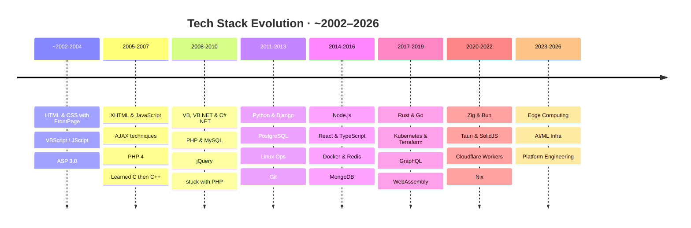
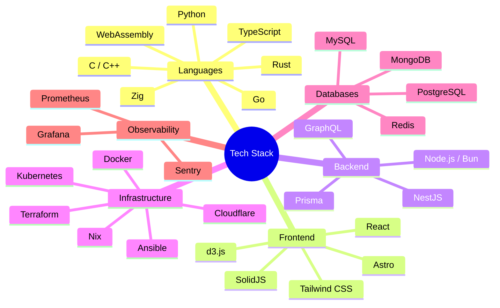
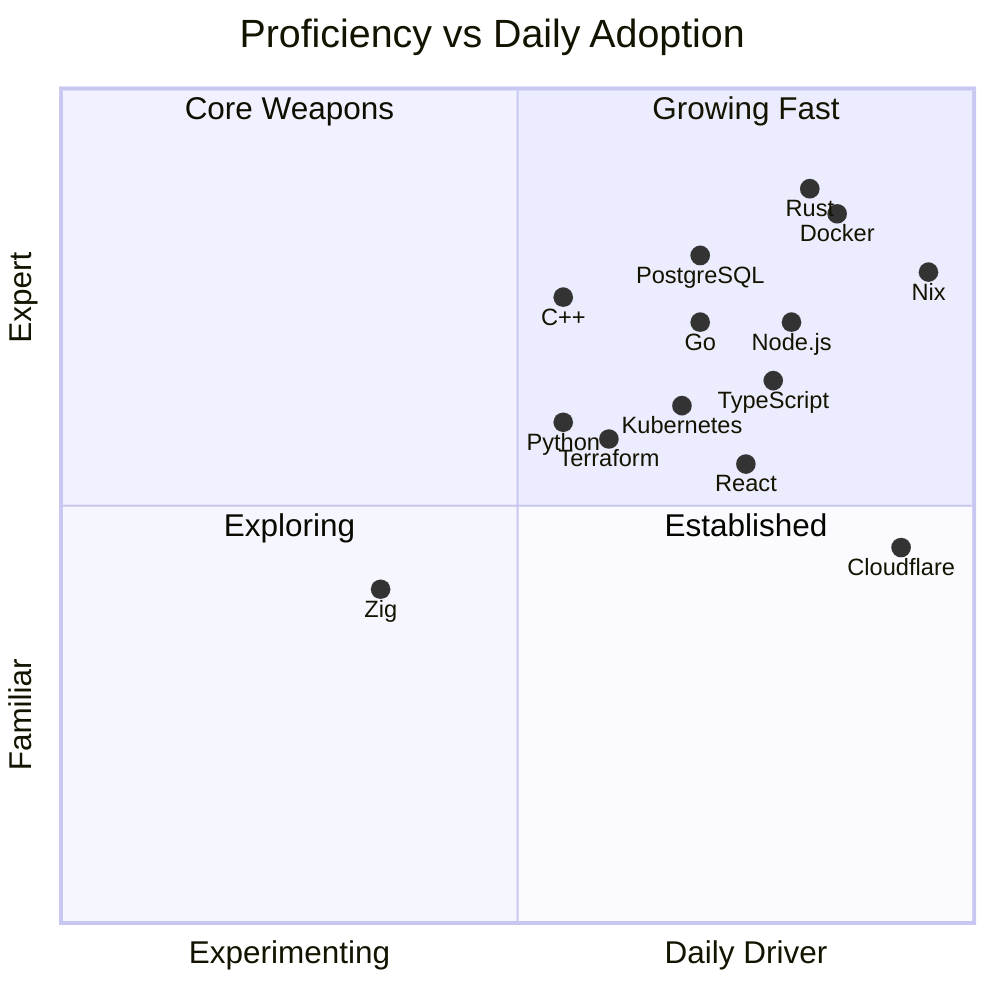

+++
title = "Tech Stack Evolution"
template = "static-page.html"

[extra]
mermaid = true
+++

## The Journey

From FrontPage to edge computing — over two decades of evolution.

## Current Stack by Category

## Proficiency & Adoption Matrix

